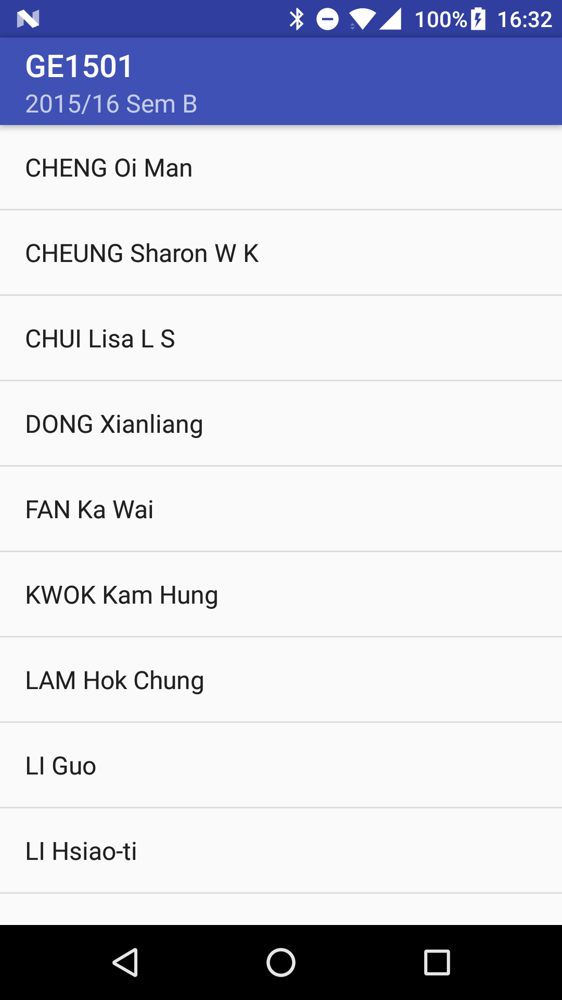

# RxJava Demo

Just a small demo project of using RxJava 2 + Retrofit.

The app tries to load a course detail JSON and extract the name of instructors from a list of objects.

See the Rx usage in *com.example.rxjavademo.ui.MainActivity*.

The RxJava 2 adapter created by Retrofit seems not available right now. If it is available, change the line to the adapter that Retrofit provides:

````
compile 'com.jakewharton.retrofit:retrofit2-rxjava2-adapter:1.0.0'
````

